# NXP Application Code Hub

## FRDM RW612 Kitchen Timer

This demo shows a kitchen timer that has a config screen to set the timer, date and color

#### Boards: FRDM-RW612
#### Categories: Graphics, HMI, RTOS
#### Peripherals: DISPLAY
#### Toolchains: MCUXpresso IDE

## Table of Contents
1. [Software](#step1)
2. [Hardware](#step2)
3. [Setup](#step3)
4. [Results](#step4)
5. [FAQs](#step5)
6. [Support](#step6)
7. [Release Notes](#step7)

## 1. Software
This code has been implemented using MCUXpresso IDE version 11.9.0. LVGL (version 8.3.10) and all other software is included in MCUXpresso SDK - version 2.16.0 was used.

## 2. Hardware
- Purchase supported board:
    - [FRDM-RW612](https://www.nxp.com/)

- Purchase supported display:
    - [LCD-PAR-S035](https://www.nxp.com/part/LCD-PAR-S035#/)

## 3. Setup

### 3.1 Step 1
Import the project into MCUXpresso IDE by following the following sections of the "MCUXpresso IDE - User Guide" found in the documentation section of the [MCUXpresso IDE page](https://www.nxp.com/design/software/development-software/mcuxpresso-software-and-tools-/mcuxpresso-integrated-development-environment-ide:MCUXpresso-IDE):

### 3.2 Step 2

Connect the Low Cost Display to the board as shown in the following image:

Low Cost Display:

[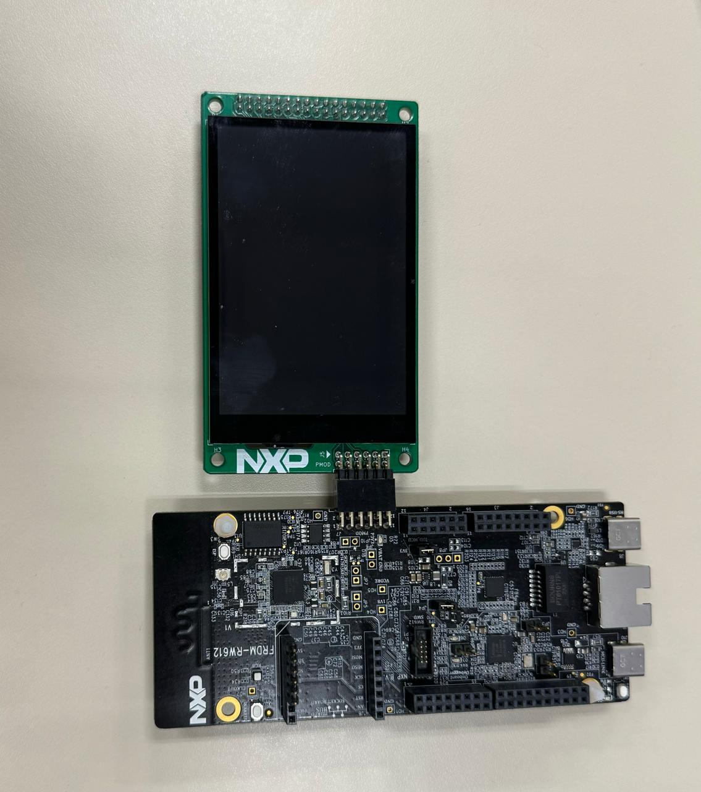](./doc/images/LCD_Connection.png)

Make sure the LCD is configured to use SPI 4-wire

[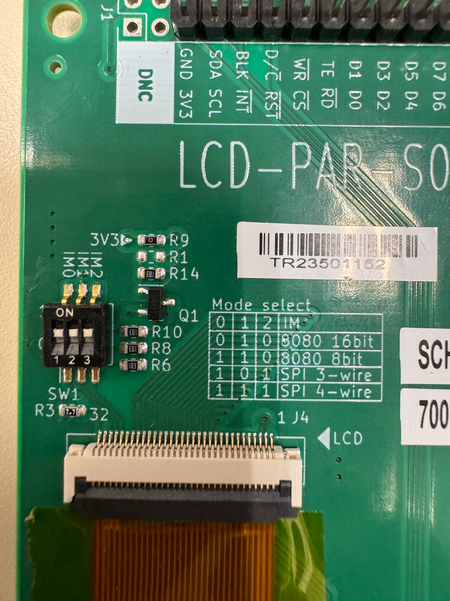](./doc/images/SPI_4_wire.png)

Connect the USB's type C from J10(MCU-LINK) to the computer as shown in the following image:

[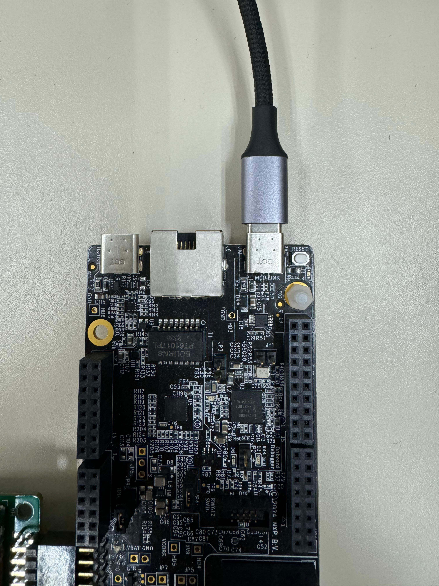](./doc/images/USB.png)

### 3.3 Step 3

Press Alt+Enter to open properties and set the display macro to use the mounted board

LCD-PAR0S035=1

as shown in the following image:
[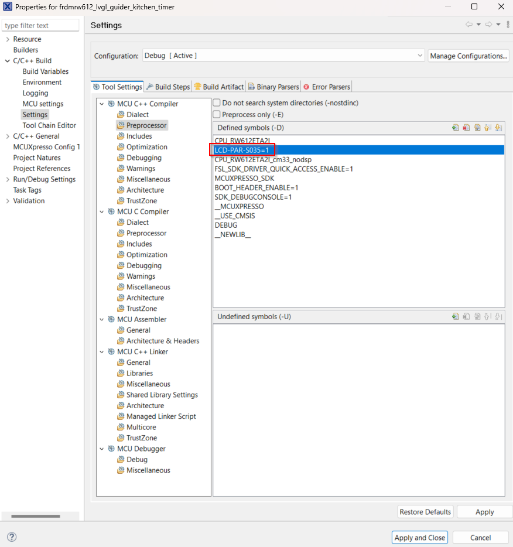](./doc/images/Settings.png)

### 3.4 Step 4

Build and download the Demo to the board

## 4. Results
Now you can interact with the Kitchen Timer by setting a new timer, a new date and a new color.

[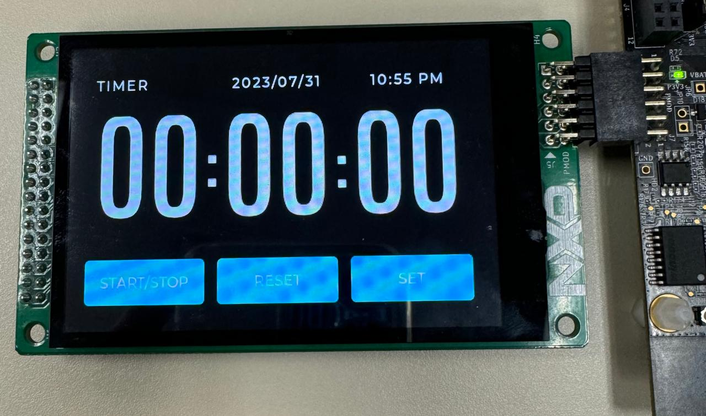](./doc/images/Init_Screen.png)

[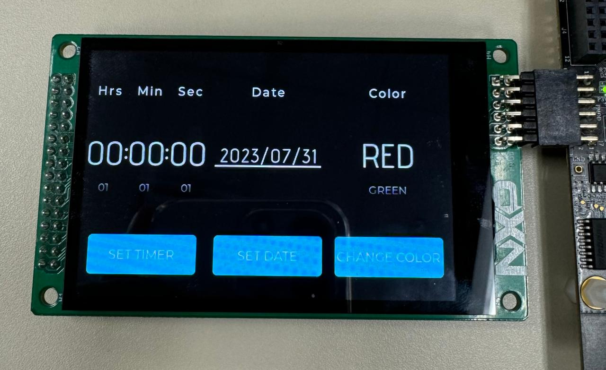](./doc/images/Settings_Screen.png)

[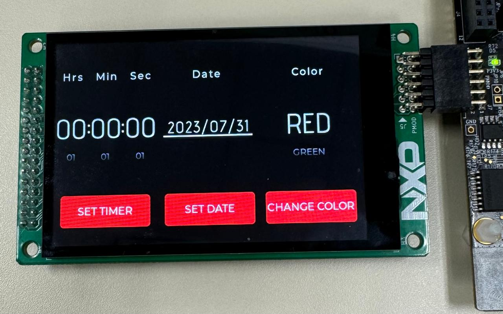](./doc/images/Change_Color.png)

[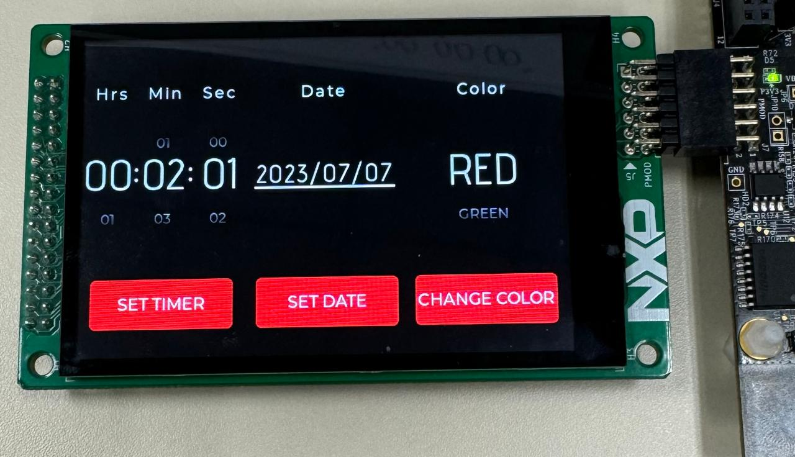](./doc/images/Set_Timer.png)

[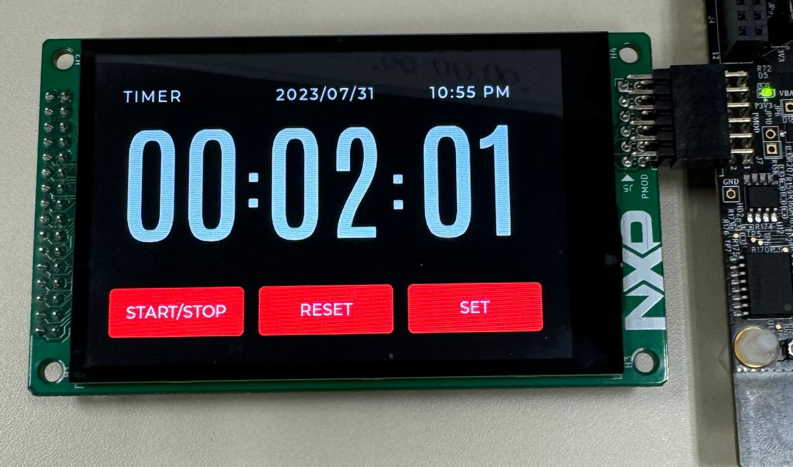](./doc/images/Timer.png)

[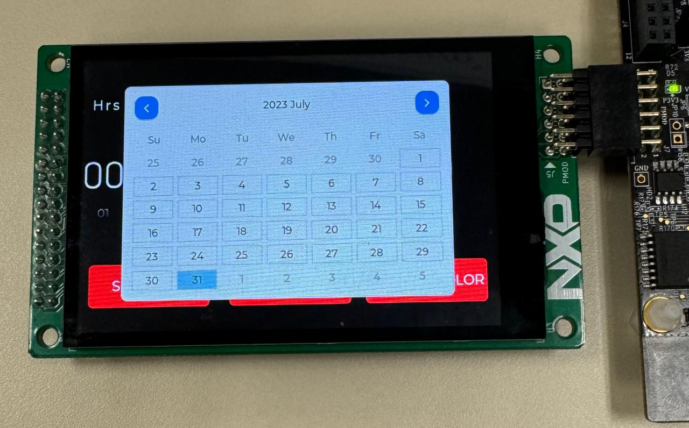](./doc/images/Date.png)

also you can view the Kitchen Timer on a terminal.

[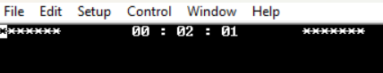](./doc/images/Terminal.png)

## 5. FAQs

## 6. Support
If you have any questions or feedback on this code please contact NXP support or post on our community at https://community.nxp.com/. You can find forums here for different aspects of this code example, including GUI Guider, MCUXpresso tools and device families.

#### Project Metadata

<!----- Boards ----->

<!----- Categories ----->

<!----- Peripherals ----->

<!----- Toolchains ----->

Questions regarding the content/correctness of this example can be entered as Issues within this GitHub repository.

>**Warning**: For more general technical questions regarding NXP Microcontrollers and the difference in expected functionality, enter your questions on the [NXP Community Forum](https://community.nxp.com/)

## 7. Release Notes
| Version | Description / Update                           | Date                        |
|:-------:|------------------------------------------------|----------------------------:|
| 1.0     | Initial release on Application Code Hub        | August 6th 2024 |

<small>
<b>Trademarks and Service Marks</b>: There are a number of proprietary logos, service marks, trademarks, slogans and product designations ("Marks") found on this Site. By making the Marks available on this Site, NXP is not granting you a license to use them in any fashion. Access to this Site does not confer upon you any license to the Marks under any of NXP or any third party's intellectual property rights. While NXP encourages others to link to our URL, no NXP trademark or service mark may be used as a hyperlink without NXP’s prior written permission. The following Marks are the property of NXP. This list is not comprehensive; the absence of a Mark from the list does not constitute a waiver of intellectual property rights established by NXP in a Mark.
</small>
 
<small>
NXP, the NXP logo, NXP SECURE CONNECTIONS FOR A SMARTER WORLD, Airfast, Altivec, ByLink, CodeWarrior, ColdFire, ColdFire+, CoolFlux, CoolFlux DSP, DESFire, EdgeLock, EdgeScale, EdgeVerse, elQ, Embrace, Freescale, GreenChip, HITAG, ICODE and I-CODE, Immersiv3D, I2C-bus logo , JCOP, Kinetis, Layerscape, MagniV, Mantis, MCCI, MIFARE, MIFARE Classic, MIFARE FleX, MIFARE4Mobile, MIFARE Plus, MIFARE Ultralight, MiGLO, MOBILEGT, NTAG, PEG, Plus X, POR, PowerQUICC, Processor Expert, QorIQ, QorIQ Qonverge, RoadLink wordmark and logo, SafeAssure, SafeAssure logo , SmartLX, SmartMX, StarCore, Symphony, Tower, TriMedia, Trimension, UCODE, VortiQa, Vybrid are trademarks of NXP B.V. All other product or service names are the property of their respective owners. © 2021 NXP B.V.
</small>
